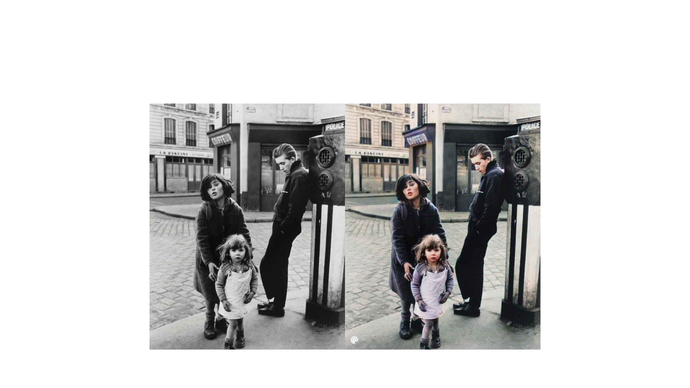

# DeOldify is a projet to colorize and restore old images and film footage.

> All credits: https://github.com/jantic/DeOldify

DeOldify is a **Black and White image Colorizing library created by Jason Antic**. DeOldify introduced the NoGAN technique to solve some of the key problems to make hyper-realistic colorization images and video. DeOldify provides **three primary models for different use case**.

Each of these has some limitations and benefit:

#### Artistic Model
This model achieves **vibrant color and detailed images**, but you have to adjust the parameters a lot to get the best results. You have to adjust the rendering resolution and factors to get the most accurate colorize image.

The model uses a **resnet34 backbone on a UNet** with an emphasis on the depth of layers on the decoder side. And it is trained on five critic pretrain/GAN cycle repeats via NoGAN.

#### Stable Model 
This model archives the **best results in portraits and landscapes**. It makes sure nothing got too much colored and makes the most part of the image remain gray like faces and limbs. It is less hyper-realistic but it makes sure nothing looks more colored.

It uses a **resnet101 backbone on a UNet** with an emphasis on the width of layers on the decoder side.

#### Video Model
As the name suggests, it is a model used to **color the videos** and we are going to see each of these models working in a python environment. It gives smooth, consistent, and flicker-free Video. This model is the same as a stable model in the case of architecture but different in training. **DeOldify is trained on 2.2% of Imagenet dataset once at 192px, using only the initial generator/critic pretrain/GAN NoGAN training.**

